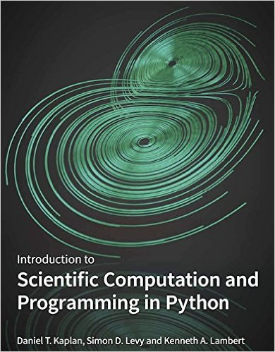

This repository contains Python programs and data files for the textbook
[Introduction to Scientific Computation and Programming in Python](http://project-mosaic-books.com/?page_id=19)
by Daniel T. Kaplan, Simon D. Levy, and Kenneth A. Lambert, Mosaic Press (2016).
Where the repository code differs from the code in the texbook, you should consider
the textbook code to be in error.
